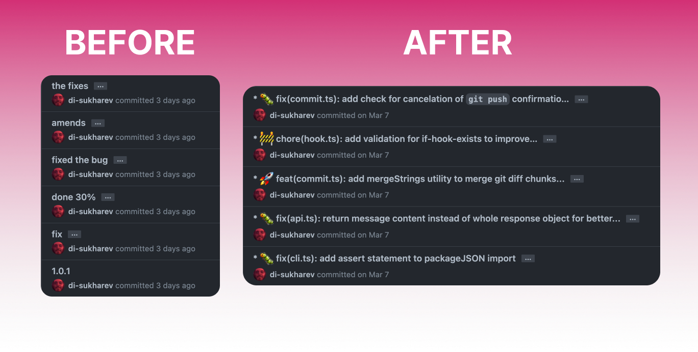

<div align="center">
  <div>
    
    <h1 align="center">OpenCommit</h1>
    <h4 align="center">Follow the bird <a href="https://twitter.com/_sukharev_"></a>
  </div>
	<h2>Auto-generate meaningful commits in a second</h2>
	<p>Killing lame commits with AI 🤯🔫</p>
	<a href="https://www.npmjs.com/package/opencommit"></a>
  <h4 align="center">🪩 Winner of <a href="https://twitter.com/_sukharev_/status/1683448136973582336">GitHub 2023 hackathon</a> 🪩</h4>
</div>

---

<div align="center">
    
</div>

All the commits in this repo are authored by OpenCommit — look at [the commits](https://github.com/di-sukharev/opencommit/commit/eae7618d575ee8d2e9fff5de56da79d40c4bc5fc) to see how OpenCommit works. Emojis and long commit descriptions are configurable.

## Setup OpenCommit as a CLI tool

You can use OpenCommit by simply running it via the CLI like this `oco`. 2 seconds and your staged changes are committed with a meaningful message.

1. Install OpenCommit globally to use in any repository:

   ```sh
   npm install -g opencommit
   ```

   Alternatively run it via `npx opencommit` or `bunx opencommit`

   MacOS may ask to run the command with `sudo` when installing a package globally.

2. Get your API key from [OpenAI](https://platform.openai.com/account/api-keys). Make sure that you add your payment details, so the API works.

3. Set the key to OpenCommit config:

   ```sh
   oco config set OCO_OPENAI_API_KEY=<your_api_key>
   ```

   Your API key is stored locally in the `~/.opencommit` config file.

## Usage

You can call OpenCommit directly to generate a commit message for your staged changes:

```sh
git add <files...>
opencommit
```

You can also use the `oco` shortcut:

```sh
git add <files...>
oco
```

### Running locally with Ollama

You can also run it with local model through ollama:

- install and start ollama
- run `ollama run mistral` (do this only once, to pull model)
- run (in your project directory):

```sh
git add <files...>
OCO_AI_PROVIDER='ollama' opencommit
```

If you want to use a model other than mistral, you can do so by setting the `OCO_AI_PROVIDER` environment variable as follows:

```sh
OCO_AI_PROVIDER='ollama/llama3:8b' opencommit
```

if you have ollama that is set up in docker/ on another machine with GPUs (not locally), you can change the default endpoint url.
You can do so by setting the `OCO_OLLAMA_API_URL` environment variable as follows:

```sh
OCO_OLLAMA_API_URL='http://192.168.1.10:11434/api/chat' opencommit
```

where 192.168.1.10 is example of endpoint URL, where you have ollama set up.

### Flags

There are multiple optional flags that can be used with the `oco` command:

#### Use Full GitMoji Specification

Link to the GitMoji specification: https://gitmoji.dev/

This flag can only be used if the `OCO_EMOJI` configuration item is set to `true`. This flag allows users to use all emojis in the GitMoji specification, By default, the GitMoji full specification is set to `false`, which only includes 10 emojis (🐛✨📝🚀✅♻️⬆️🔧🌐💡).
This is due to limit the number of tokens sent in each request. However, if you would like to use the full GitMoji specification, you can use the `--fgm` flag.

```
oco --fgm
```

#### Skip Commit Confirmation

This flag allows users to automatically commit the changes without having to manually confirm the commit message. This is useful for users who want to streamline the commit process and avoid additional steps. To use this flag, you can run the following command:

```
oco --yes
```

## Configuration

### Local per repo configuration

Create a `.env` file and add OpenCommit config variables there like this:

```env
OCO_OPENAI_API_KEY=<your OpenAI API token>
OCO_TOKENS_MAX_INPUT=<max model token limit (default: 4096)>
OCO_TOKENS_MAX_OUTPUT=<max response tokens (default: 500)>
OCO_OPENAI_BASE_PATH=<may be used to set proxy path to OpenAI api>
OCO_DESCRIPTION=<postface a message with ~3 sentences description of the changes>
OCO_EMOJI=<boolean, add GitMoji>
OCO_MODEL=<either 'gpt-4o', 'gpt-4', 'gpt-4-turbo', 'gpt-3.5-turbo' (default), 'gpt-3.5-turbo-0125', 'gpt-4-1106-preview', 'gpt-4-turbo-preview' or 'gpt-4-0125-preview'>
OCO_LANGUAGE=<locale, scroll to the bottom to see options>
OCO_MESSAGE_TEMPLATE_PLACEHOLDER=<message template placeholder, default: '$msg'>
OCO_PROMPT_MODULE=<either conventional-commit or @commitlint, default: conventional-commit>
OCO_ONE_LINE_COMMIT=<one line commit message, default: false>
OCO_AI_PROVIDER=<anthropic, azure, ollama or ollama/model default ollama model: mistral>
```

### Global config for all repos

Local config still has more priority than Global config, but you may set `OCO_MODEL` and `OCO_LOCALE` globally and set local configs for `OCO_EMOJI` and `OCO_DESCRIPTION` per repo which is more convenient.

Simply set any of the variables above like this:

```sh
oco config set OCO_MODEL=gpt-4o
```

Configure [GitMoji](https://gitmoji.dev/) to preface a message.

```sh
oco config set OCO_EMOJI=true
```

To remove preface emojis:

```sh
oco config set OCO_EMOJI=false
```

### Switch to GPT-4 or other models

By default, OpenCommit uses `gpt-4o` model.

You may switch to GPT-4 which performs better, but costs ~x15 times more 🤠

```sh
oco config set OCO_MODEL=gpt-4
```

or for as a cheaper option:

```sh
oco config set OCO_MODEL=gpt-4o-mini
```

### Switch to Azure OpenAI

By default OpenCommit uses [OpenAI](https://openai.com).

You could switch to [Azure OpenAI Service](https://learn.microsoft.com/azure/cognitive-services/openai/)🚀

```sh
opencommit config set OCO_AI_PROVIDER=azure
```

Of course need to set 'OPENAI_API_KEY'. And also need to set the
'OPENAI_BASE_PATH' for the endpoint and set the deployment name to
'model'.

### Locale configuration

To globally specify the language used to generate commit messages:

```sh
# de, German ,Deutsch
oco config set OCO_LANGUAGE=de
oco config set OCO_LANGUAGE=German
oco config set OCO_LANGUAGE=Deutsch

# fr, French, française
oco config set OCO_LANGUAGE=fr
oco config set OCO_LANGUAGE=French
oco config set OCO_LANGUAGE=française
```

The default language setting is **English**
All available languages are currently listed in the [i18n](https://github.com/di-sukharev/opencommit/tree/master/src/i18n) folder

### Push to git

Pushing to git is on by default but if you would like to turn it off just use:

```sh
oco config set OCO_GITPUSH=false
```

### Switch to `@commitlint`

OpenCommit allows you to choose the prompt module used to generate commit messages. By default, OpenCommit uses its conventional-commit message generator. However, you can switch to using the `@commitlint` prompt module if you prefer. This option lets you generate commit messages in respect with the local config.

You can set this option by running the following command:

```sh
oco config set OCO_PROMPT_MODULE=<module>
```

Replace `<module>` with either `conventional-commit` or `@commitlint`.

#### Example:

To switch to using the `'@commitlint` prompt module, run:

```sh
oco config set OCO_PROMPT_MODULE=@commitlint
```

To switch back to the default conventional-commit message generator, run:

```sh
oco config set OCO_PROMPT_MODULE=conventional-commit
```

#### Integrating with `@commitlint`

The integration between `@commitlint` and OpenCommit is done automatically the first time OpenCommit is run with `OCO_PROMPT_MODULE` set to `@commitlint`. However, if you need to force set or reset the configuration for `@commitlint`, you can run the following command:

```sh
oco commitlint force
```

To view the generated configuration for `@commitlint`, you can use this command:

```sh
oco commitlint get
```

This allows you to ensure that the configuration is set up as desired.

Additionally, the integration creates a file named `.opencommit-commitlint` which contains the prompts used for the local `@commitlint` configuration. You can modify this file to fine-tune the example commit message generated by OpenAI. This gives you the flexibility to make adjustments based on your preferences or project guidelines.

OpenCommit generates a file named `.opencommit-commitlint` in your project directory which contains the prompts used for the local `@commitlint` configuration. You can modify this file to fine-tune the example commit message generated by OpenAI. If the local `@commitlint` configuration changes, this file will be updated the next time OpenCommit is run.

This offers you greater control over the generated commit messages, allowing for customization that aligns with your project's conventions.

## Git flags

The `opencommit` or `oco` commands can be used in place of the `git commit -m "${generatedMessage}"` command. This means that any regular flags that are used with the `git commit` command will also be applied when using `opencommit` or `oco`.

```sh
oco --no-verify
```

is translated to :

```sh
git commit -m "${generatedMessage}" --no-verify
```

To include a message in the generated message, you can utilize the template function, for instance:

```sh
oco '#205: $msg’
```

> opencommit examines placeholders in the parameters, allowing you to append additional information before and after the placeholders, such as the relevant Issue or Pull Request. Similarly, you have the option to customize the OCO_MESSAGE_TEMPLATE_PLACEHOLDER configuration item, for example, simplifying it to $m!"

### Message Template Placeholder Config

#### Overview

The `OCO_MESSAGE_TEMPLATE_PLACEHOLDER` feature in the `opencommit` tool allows users to embed a custom message within the generated commit message using a template function. This configuration is designed to enhance the flexibility and customizability of commit messages, making it easier for users to include relevant information directly within their commits.

#### Implementation Details

In our codebase, the implementation of this feature can be found in the following segment:

```javascript
commitMessage = messageTemplate.replace(
  config?.OCO_MESSAGE_TEMPLATE_PLACEHOLDER,
  commitMessage
);
```

This line is responsible for replacing the placeholder in the `messageTemplate` with the actual `commitMessage`.

#### Usage

For instance, using the command `oco '$msg #205’`, users can leverage this feature. The provided code represents the backend mechanics of such commands, ensuring that the placeholder is replaced with the appropriate commit message.

#### Committing with the Message

Once users have generated their desired commit message, they can proceed to commit using the generated message. By understanding the feature's full potential and its implementation details, users can confidently use the generated messages for their commits.

### Ignore files

You can remove files from being sent to OpenAI by creating a `.opencommitignore` file. For example:

```ignorelang
path/to/large-asset.zip
**/*.jpg
```

This helps prevent opencommit from uploading artifacts and large files.

By default, opencommit ignores files matching: `*-lock.*` and `*.lock`

## Git hook (KILLER FEATURE)

You can set OpenCommit as Git [`prepare-commit-msg`](https://git-scm.com/docs/githooks#_prepare_commit_msg) hook. Hook integrates with your IDE Source Control and allows you to edit the message before committing.

To set the hook:

```sh
oco hook set
```

To unset the hook:

```sh
oco hook unset
```

To use the hook:

```sh
git add <files...>
git commit
```

Or follow the process of your IDE Source Control feature, when it calls `git commit` command — OpenCommit will integrate into the flow.

## Setup OpenCommit as a GitHub Action (BETA) 🔥

OpenCommit is now available as a GitHub Action which automatically improves all new commits messages when you push to remote!

This is great if you want to make sure all of the commits in all of your repository branches are meaningful and not lame like `fix1` or `done2`.

Create a file `.github/workflows/opencommit.yml` with the contents below:

```yml
name: 'OpenCommit Action'

on:
  push:
    # this list of branches is often enough,
    # but you may still ignore other public branches
    branches-ignore: [main master dev development release]

jobs:
  opencommit:
    timeout-minutes: 10
    name: OpenCommit
    runs-on: ubuntu-latest
    permissions: write-all
    steps:
      - name: Setup Node.js Environment
        uses: actions/setup-node@v2
        with:
          node-version: '16'
      - uses: actions/checkout@v3
        with:
          fetch-depth: 0
      - uses: di-sukharev/opencommit@github-action-v1.0.4
        with:
          GITHUB_TOKEN: ${{ secrets.GITHUB_TOKEN }}

        env:
          # set openAI api key in repo actions secrets,
          # for openAI keys go to: https://platform.openai.com/account/api-keys
          # for repo secret go to: <your_repo_url>/settings/secrets/actions
          OCO_OPENAI_API_KEY: ${{ secrets.OCO_OPENAI_API_KEY }}

          # customization
          OCO_TOKENS_MAX_INPUT: 4096
          OCO_TOKENS_MAX_OUTPUT: 500
          OCO_OPENAI_BASE_PATH: ''
          OCO_DESCRIPTION: false
          OCO_EMOJI: false
          OCO_MODEL: gpt-4o
          OCO_LANGUAGE: en
          OCO_PROMPT_MODULE: conventional-commit
```

That is it. Now when you push to any branch in your repo — all NEW commits are being improved by your never-tired AI.

Make sure you exclude public collaboration branches (`main`, `dev`, `etc`) in `branches-ignore`, so OpenCommit does not rebase commits there while improving the messages.

Interactive rebase (`rebase -i`) changes commits' SHA, so the commit history in remote becomes different from your local branch history. This is okay if you work on the branch alone, but may be inconvenient for other collaborators.

## Payments

You pay for your requests to OpenAI API on your own.

OpenCommit stores your key locally.

OpenCommit by default uses 3.5-turbo model, it should not exceed $0.10 per casual working day.

You may switch to gpt-4, it's better, but more expensive.
